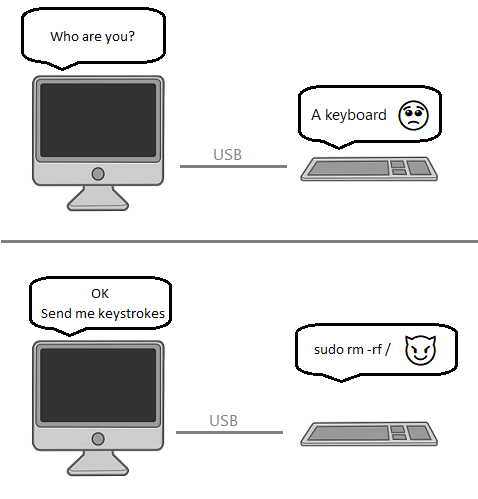

# Keystroker
A USB HID device to perform USB drop attack

Research presented at BlackHat USA 2016 by Elie Bursztein of Google’s anti-abuse research team shows that the danger is alarmingly real!

[Watch this video to know more](https://www.youtube.com/watch?v=ZI5fvU5QKwQ&feature=emb_logo)

## How it works?

[Know more by reading these instructables](https://www.instructables.com/Keystroker-USB-Drop-Attack/)

## Steps to build the Keystroker 
1. Procure electronics components from a reliable source
1. Send the Gerber files to a PCB manufacturer to get a PCB made
1. 3D print the enclosure
1. Solder the components on the PCB, upload the firmware and test
1. Finally, mount the PCB in the enclosure

### Keystroker 3D render

## If you prefer using an Arduino Pro Micro
1. Remove the USB receptacle  
1. Use superglue to attach a USB type A plug
1. Connect the pins of the USB type A plug to the USB receptacle pads
1. Upload the firmware 

### Made with lots of ⏱️, 📚 and ☕ by InputBlackBoxOutput
